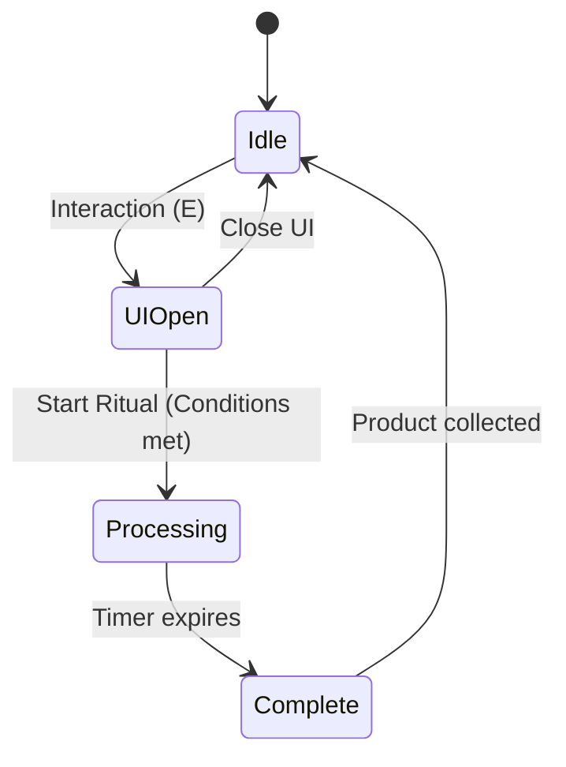

# Super Fantasy Factory - MVP High-Level Architecture

> **Last Updated:** 2026-01-08

This document outlines the architecture for testing the core gameplay loop of Super Fantasy Factory: **Player → Creative Chest → Toolbar → Assembly Station → Ritual → Skeleton Spawn**.

---

## Implementation Status

| Step | Task | Status | Notes |
| :--: | :--- | :----: | :---- |
| 1 | **Foundation**: Define materials, recipes, and global mana state | ✅ Done | `src/data/materials.lua`, `src/data/recipes.lua`, `src/entities/mana_pool.lua` |
| 2 | **Toolbar**: Implement the player toolbar and selection logic | ✅ Done | `src/entities/toolbar.lua`, `src/ui/inventory_view.lua`, `src/systems/ui_system.lua` |
| 3 | **Chest**: Create the Creative Chest for infinite bone supply | ✅ Done | `src/entities/storage.lua`, `src/data/storages_data.lua` |
| 4 | **Station**: Implement the Assembly Station entity and its modal UI | ✅ Done | `src/entities/assembler.lua`, `src/data/assemblers_data.lua`, `src/ui/inventory_state_manager.lua` |
| 5 | **Logic**: Implement processing timers, mana deduction, and creature spawning | 🔄 In Progress | Next: state machine for station processing |

### Additional Progress

- ✅ **ECS Architecture**: Nata-based entity pool (`src/ecs.lua`)
- ✅ **Interaction System**: Proximity detection + mouse-based interaction (`src/systems/interaction_system.lua`)
- ✅ **Input System**: Player input handling (`src/systems/input_system.lua`)
- ✅ **UI System**: Toolbar rendering, inventory popups, item transfer (`src/systems/ui_system.lua`)
- ✅ **Inventory Component**: Reusable inventory logic (`src/components/inventory_component.lua`)
- ⬜ **Station State Machine**: Idle → Processing → Complete flow (pending)
- ⬜ **Mana Integration**: Deducting mana when starting rituals (pending)
- ⬜ **Creature Spawning**: Spawning skeletons on ritual completion (pending)

## Core Gameplay Flow

1. **Material Acquisition**: Player interacts with a **Creative Chest** to get bones.
2. **Inventory Management**: Items are stored in a **Factorio-style toolbar** (9 slots).
3. **Station Interaction**: Player approaches an **Assembly Station** and opens its UI.
4. **Recipe Fulfillment**: Player inserts ingredients from their toolbar into the station.
5. **Ritual Initiation**: Player starts the ritual, consuming mana and time.
6. **Product Collection**: Station spawns a **Skeleton** which can be collected.

---

## Entity Specifications

| Entity | Visual Representation | Size/Radius | Color (Placeholder) |
| :--- | :--- | :--- | :--- |
| **Player** | Circle | r = 16px | Blue |
| **Assembly Station** | Square | 64 × 64px | Purple |
| **Bone** | Square | 8 × 8px | White |
| **Essence** | Circle | r = 16px | Cyan |
| **Creative Chest** | Square | 32 × 32px | Gold |
| **Skeleton** | Circle | r = 16px | Gray |

---

## Technical Systems

### 1. Data Layer (`src/data/`)

Static definitions for materials and recipes. This allows easy balancing of mana costs and processing times.

### 2. State Layer (`src/state/`)

- **Mana Pool**: Global resource tracking.
- **Inventory**: Logic for the 9-slot toolbar, including selection and stacking.

### 3. Entity Layer (`src/entities/`)

ECS-style entities using the `nata` library. Each entity type (Player, Station, etc.) will have its own factory/class.

### 4. System Layer (`src/systems/`)

- **Interaction System**: Handles proximity detection and "E" key presses.
- **Station System**: Manages the state machine for assembly stations (Idle, Processing, etc.).
- **UI System**: Renders the HUD (toolbar) and modal popups for stations.

---

## Detailed UI Design

### Toolbar

- 9 slots visible at the bottom of the screen.
- Select active slot via number keys **1-9**.
- Context-aware interaction based on the item in the active slot.

### Assembly Station Popup

A modal window appearing on interaction:

- **Title**: Recipe name (e.g., "Assemble Skeleton").
- **Ingredient Slots**: Visual slots showing current/required amounts.
- **Cost/Time**: Display of mana cost and processing duration.
- **Output Slot**: Holds the finished product until collected by the player.
- **Action Button**: "Start Ritual".

---

## Assembly Station State Machine

---

## Implementation Roadmap

1. **Foundation**: Define materials, recipes, and global mana state.
2. **Toolbar**: Implement the player toolbar and selection logic.
3. **Chest**: Create the Creative Chest for infinite bone supply.
4. **Station**: Implement the Assembly Station entity and its modal UI.
5. **Logic**: Implement processing timers, mana deduction, and creature spawning.
